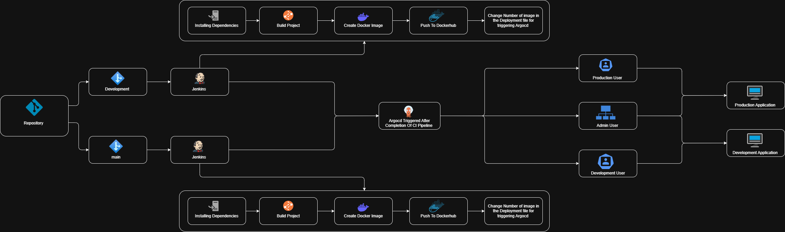
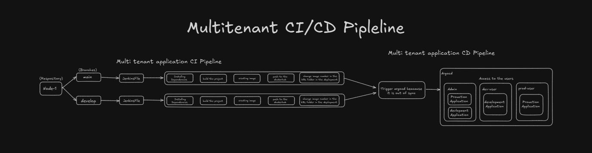
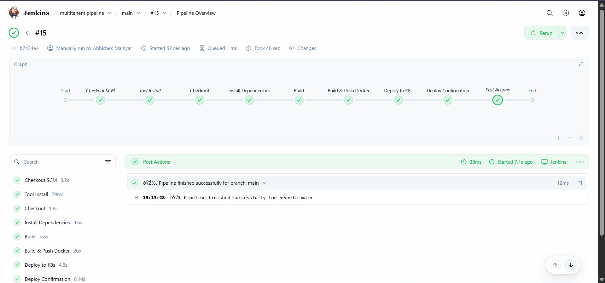
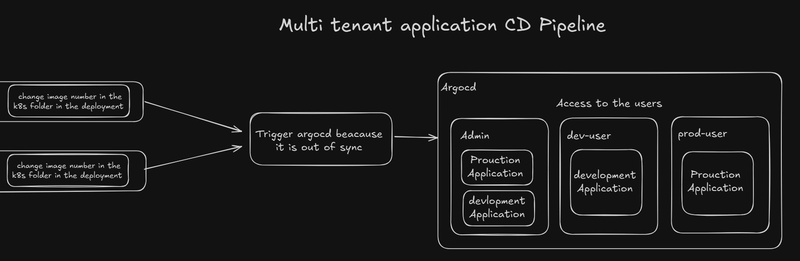
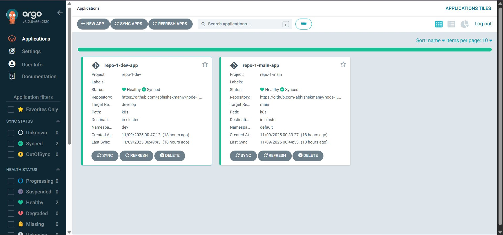
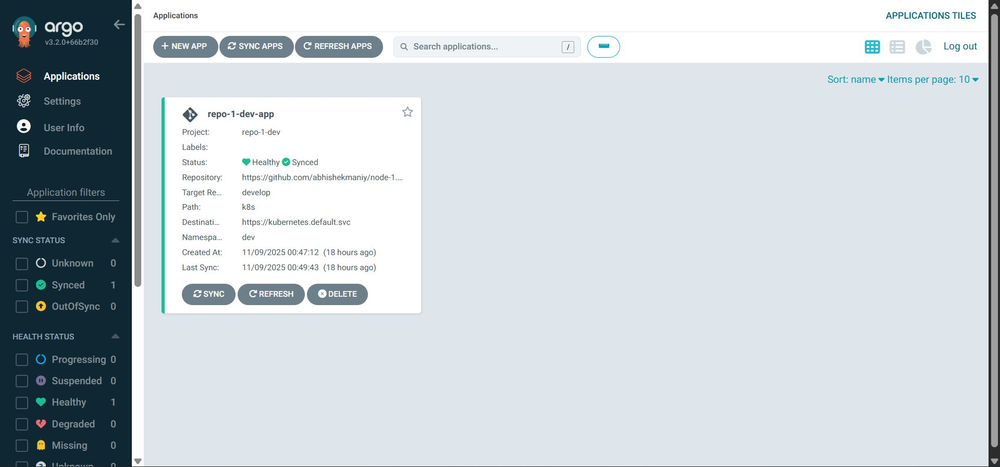
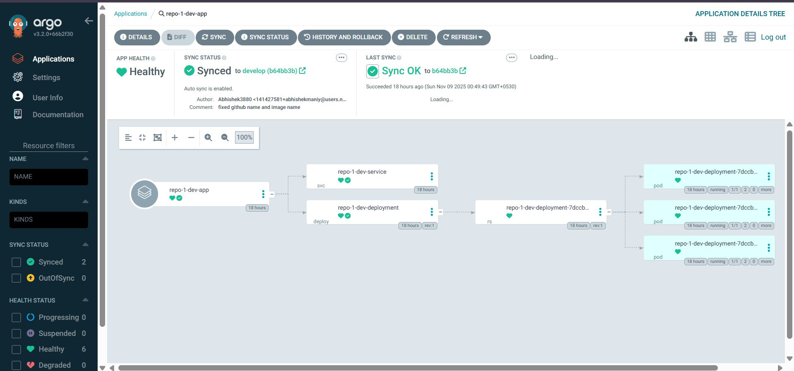
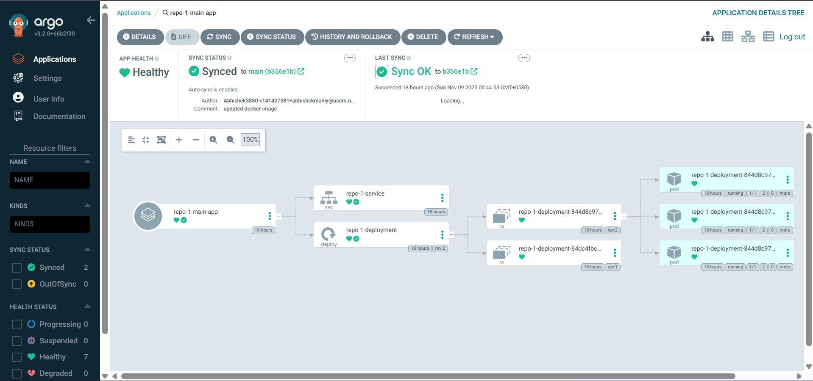

# 🚀 Multitenant CI/CD Pipeline — Node.js on Kubernetes

A fully automated multitenant CI/CD pipeline for a Node.js application, using **Jenkins** for continuous integration and **ArgoCD** for GitOps-based continuous deployment on **Kubernetes**. The pipeline supports two separate branches (`main` and `develop`), each with its own isolated deployment environment and user access control.

---

## 📐 Architecture Overview




The system is built around two main phases:

**CI Pipeline (Jenkins):** Code pushed to either branch triggers Jenkins, which installs dependencies, builds the project, creates a Docker image, pushes it to DockerHub, and updates the Kubernetes deployment manifest with the new image tag.

**CD Pipeline (ArgoCD):** ArgoCD watches the `k8s/` folder in the GitHub repository. When it detects a change (the updated image tag), it automatically syncs and deploys the latest image to the appropriate Kubernetes namespace.

---

## 🗺️ Pipeline Walkthrough



### Flow Summary

```
Repository (node-1)
    ├── branch: main     → Jenkins → CI Steps → DockerHub → k8s/deployment.yaml updated → ArgoCD syncs → default namespace
    └── branch: develop  → Jenkins → CI Steps → DockerHub → k8s/deployment.yaml updated → ArgoCD syncs → dev namespace
```

---

## ⚙️ CI Pipeline — Jenkins

Each branch (`main` and `develop`) has its own Jenkins pipeline defined by a `Jenkinsfile` at the root of the repository.



### Pipeline Stages

| Stage | Description |
|---|---|
| **Checkout SCM** | Checks out the correct branch |
| **Tool Install** | Sets up Node.js v20 from Jenkins tool config |
| **Checkout** | Re-confirms source checkout |
| **Install Dependencies** | Runs `npm install` |
| **Build** | Compiles TypeScript via `npm run build` |
| **Build & Push Docker** | Builds Docker image tagged with `BUILD_NUMBER`, pushes to DockerHub |
| **Deploy to K8s** | Updates `k8s/deployment.yaml` with new image tag, commits and pushes to GitHub |
| **Deploy Confirmation** | Logs success message for the branch |

### Key Jenkinsfile Behavior

- **Docker image tag** uses `BUILD_NUMBER` (e.g., `abhishekmaniyar3811/node-1-prod:15`) to ensure every build produces a unique, traceable image.
- **Deploy to K8s stage** uses PowerShell to perform a regex replace on `k8s/deployment.yaml`, updating the image tag inline, then commits and pushes to GitHub. This change is what triggers ArgoCD.
- **Credentials** are managed securely via Jenkins credential store (`dockerhub` and `github-credentials` IDs).

```groovy
// Image tag update in deployment.yaml (from Jenkinsfile)
bat '''
  powershell -Command "$content = Get-Content 'k8s/deployment.yaml' -Raw;
  $content = $content -replace 'image: ...node-1-prod(:[\\w.-]+)?',
  'image: ...node-1-prod:%BUILD_NUMBER%';
  Set-Content 'k8s/deployment.yaml' -Value $content"
'''
```

---

## 📦 Docker Image

Images are built and pushed to DockerHub with the Jenkins build number as the tag:

```
abhishekmaniyar3811/node-1-prod:<BUILD_NUMBER>
```

Each new Jenkins run produces a new image and immediately updates the deployment manifest.

---

## 📄 Kubernetes Deployment (`k8s/deployment.yaml`)

```yaml
apiVersion: apps/v1
kind: Deployment
metadata:
  name: repo-1-deployment
spec:
  replicas: 3
  selector:
    matchLabels:
      app: repo-1
  template:
    metadata:
      labels:
        app: repo-1
    spec:
      containers:
      - name: repo-1
        image: abhishekmaniyar3811/node-1-prod:15   # ← Updated automatically by Jenkins
        ports:
        - containerPort: 3000
```

The `image:` field is the only thing Jenkins modifies. ArgoCD detects this change and triggers a sync.

---

## 🔄 CD Pipeline — ArgoCD



ArgoCD is configured with **two applications**, one per branch:

| ArgoCD App | GitHub Branch | Namespace | Project |
|---|---|---|---|
| `repo-1-main-app` | `main` | `default` | `repo-1-main` |
| `repo-1-dev-app` | `develop` | `dev` | `repo-1-dev` |

### ArgoCD Applications Dashboard



Both applications monitor the `k8s/` path in the GitHub repository. Auto-sync is enabled, so when Jenkins pushes the updated `deployment.yaml`, ArgoCD immediately detects the out-of-sync state and deploys the new image.

---

## 🌿 Dev App — ArgoCD Details





- **Target Branch:** `develop`
- **Namespace:** `dev`
- **Path:** `k8s/`
- **Auto-sync:** Enabled
- **Last commit message:** `fixed github name and image name`

---

## 🏭 Main App — ArgoCD Details




- **Target Branch:** `main`
- **Namespace:** `default`
- **Path:** `k8s/`
- **Auto-sync:** Enabled
- **Last commit message:** `updated docker image`

---

## 👥 Multi-Tenant User Access

Access to applications in ArgoCD is controlled by role, creating a true multitenant setup:

| Role | Access |
|---|---|
| **Admin** | Full access — can view and manage both Production and Development applications |
| **dev-user** | Can access Development Application only |
| **prod-user** | Can access Production Application only |

This ensures environment isolation: developers cannot accidentally affect production, and production users are not exposed to development deployments.

---

## 🗂️ Repository Structure

```
node-1/
├── Jenkinsfile          # CI pipeline definition (shared by both branches)
├── k8s/
│   └── deployment.yaml  # Kubernetes manifest (image tag auto-updated by Jenkins)
├── src/                 # TypeScript application source
├── dist/                # Compiled output (generated by npm run build)
├── Dockerfile           # Docker image definition
└── package.json
```

---

## 🔧 Prerequisites & Setup

### Jenkins Setup
- Jenkins with NodeJS plugin (configured as `node20`)
- Docker installed on Jenkins agent
- Credentials configured:
  - `dockerhub` — DockerHub username/password
  - `github-credentials` — GitHub username/token

### ArgoCD Setup
- ArgoCD v3.2.0 installed on Kubernetes cluster
- Two ArgoCD Projects created: `repo-1-main`, `repo-1-dev`
- Two ArgoCD Applications created pointing to the respective branches and namespaces
- RBAC configured for Admin, dev-user, and prod-user roles

### Kubernetes
- Two namespaces: `default` (production) and `dev`
- Service accounts with appropriate permissions per namespace

---

## 🔁 How a Full Deployment Works (Step by Step)

1. Developer pushes code to `main` or `develop` branch on GitHub
2. Jenkins detects the push via webhook and starts the pipeline
3. Jenkins installs dependencies, builds the TypeScript project
4. Jenkins builds a Docker image tagged with the build number and pushes to DockerHub
5. Jenkins updates `k8s/deployment.yaml` with the new image tag
6. Jenkins commits and pushes the updated manifest back to GitHub
7. ArgoCD detects that the live cluster state no longer matches the Git state (out-of-sync)
8. ArgoCD auto-syncs and applies the updated deployment to the correct namespace
9. Kubernetes performs a rolling update, replacing pods with the new image
10. The correct tenant users can access their respective environments

---

## 📊 Tech Stack

| Tool | Purpose |
|---|---|
| **Jenkins** | CI orchestration, build & push pipeline |
| **Docker / DockerHub** | Container image build and registry |
| **ArgoCD** | GitOps-based continuous deployment |
| **Kubernetes** | Container orchestration |
| **GitHub** | Source control and GitOps state store |
| **Node.js / TypeScript** | Application runtime |
| **PowerShell** | Image tag replacement in YAML (Windows agent) |

---

## 📝 Notes

- The Jenkins agent runs on **Windows** (uses `bat` commands and PowerShell for YAML manipulation).
- The `k8s/` folder acts as the single source of truth for the desired cluster state — ArgoCD never deploys anything that isn't committed to Git.
- Both pipelines use the same `Jenkinsfile` logic; branch-specific behavior is driven by `env.BRANCH_NAME`.
- Rolling deployments with `replicas: 3` ensure zero-downtime updates.